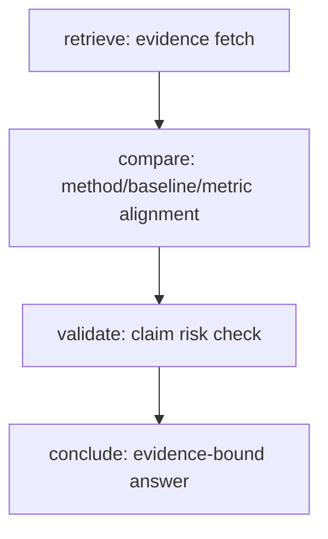

# Tool-Reasoning Minimal Design

This document defines the first production-safe version of a tool-based reasoning chain.

## Goal

Improve reasoning reliability by forcing multi-step evidence-bound processing instead of single-pass free-form generation.

## Four-Step Chain

1. `retrieve`: fetch evidence candidates from indexed sources
2. `compare`: align methods/baselines/metrics across evidence
3. `validate`: reject unsupported claims and flag risk
4. `conclude`: generate final answer only from validated claims

## Flow

## Contract Rules

- Every claim in `conclude` must reference at least one `evidence_id`.
- If evidence is insufficient, output must explicitly return `status=insufficient_evidence`.
- `validate` cannot silently pass unsupported claims.
- `conclude` cannot introduce new claims not seen in `compare`.

## Minimal Data Contracts

- `RetrieveOutput`:
  - `query`
  - `evidence[]` (`source`, `page`, `chunk_id`, `snippet`, `score`)
- `CompareOutput`:
  - `comparisons[]` (`dimension`, `claim`, `evidence_ids`)
  - `missing_dimensions[]`
- `ValidateOutput`:
  - `status` (`ok` / `insufficient_evidence` / `risk_detected`)
  - `issues[]` (`severity`, `message`, `claim_ref`)
- `ConcludeOutput`:
  - `summary`
  - `supported_claims[]` (`text`, `evidence_ids`)
  - `uncertainties[]`

## Rollout Strategy

- Phase A: run chain in shadow mode, compare with current output.
- Phase B: enable chain for one scenario only (method comparison).
- Phase C: progressively expand to other research workflows.
